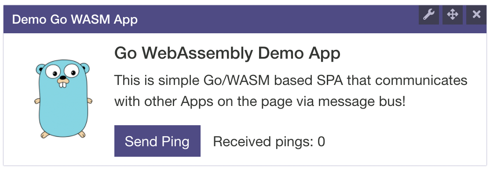

# Mashroom Portal Demo Go WebAssembly App

Plugin for [Mashroom Server](https://www.mashroom-server.com), a **Microfrontend Integration Platform**.

Demonstrates how a WebAssembly can be used as a Portal App (Microfrontend) for _Mashroom Portal_.

## Usage

If *node_modules/@mashroom* is configured as plugin path just add **@mashroom/mashroom-portal-demo-go-wasm-app** as *dependency*.

Then you can place it on any page via Admin UI.

## Development Setup

 * Install node
 * Install go 
 * Install dependencies:
        
        go mod download
        
 * Start in dev mode:
  
        npm run dev
        
 * Open in your browser: http://localhost:8055

## Links

 * Details about Go WebAssembly: https://github.com/golang/go/wiki/WebAssembly
 * W3C WebAssembly recommendation: https://www.w3.org/TR/wasm-core-1/
 * Browser support: https://caniuse.com/#feat=wasm
 
 ## Hints
 
  * The created WebAssembly is very big (around 3.5MB). This could be improved by using [TinyGo](https://tinygo.org/), 
    but unfortunately it can currently not import *text/template*. See: https://github.com/trashhalo/tinygo-import-report/blob/master/Readme.md
